# Vehicle Detection Project

The goals / steps of this project are the following:

- Perform a Histogram of Oriented Gradients (HOG) feature extraction on a labeled training set of images and train a classifier Linear SVM classifier
- Optionally, you can also apply a color transform and append binned color features, as well as histograms of color, to your HOG feature vector.
- Note: for those first two steps don't forget to normalize your features and randomize a selection for training and testing.
- Implement a sliding-window technique and use your trained classifier to search for vehicles in images.
- Run your pipeline on a video stream (start with the test_video.mp4 and later implement on full project_video.mp4) and create a heat map of recurring detections frame by frame to reject outliers and follow detected vehicles.
- Estimate a bounding box for vehicles detected.


# Report

The code of the project can be found in the vehicle_tracking.ipynb file.

### Histogram of Oriented Gradients (HOG)

#### 1. Explain how (and identify where in your code) you extracted HOG features from the training images.


```python
First we load the images of cars and non-vehicles from the files.
The code for loading images is found in the code cell 2 of the notebook.

Number of non-vehicles:8968
Number of cars:6941

Example cars and non-cars images are shown below:
```


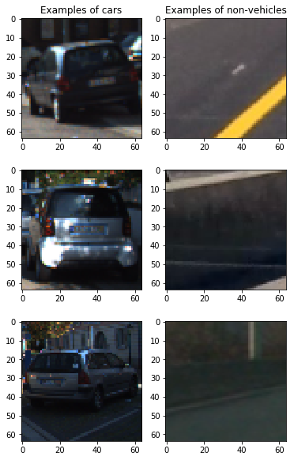


In code cells 6 and 7, the code for extracting HOG features can be found.


```python
Examples are shown below:
```

    ...


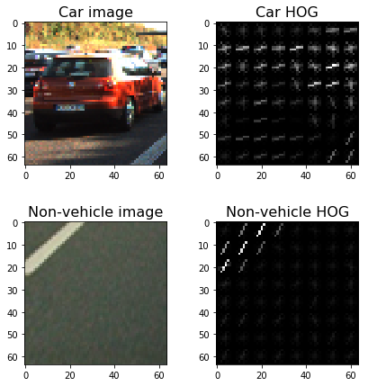


#### 2. Explain how you settled on your final choice of HOG parameters.
I explored different color spaces and different skimage.hog() parameters. For selecting the proper set of parameters, I chose one that gave good classification results.
More specifically, I used the parameter set: 

HOG features: image in RGB and grayscale, orientation = 8, pixel_per_cell = 12, cell_per_block = 2


#### 3. Describe how (and identify where in your code) you trained a classifier using your selected HOG features (and color features if you used them).

In code cell 6, the extraction of features from an image can be found.
Apart from the HOG features, I also extract spatial and color features. 
Before training the classifier, I scaled the feature vector (code cell 7)

I used the "standard" SVM classifier from sklearn.svm.SVC (code cell 8)

The Test Accuracy of the classifier is quite high, 0.9975


### Sliding Window Search

#### 1. Describe how (and identify where in your code) you implemented a sliding window search. How did you decide what scales to search and how much to overlap windows?

I tested several configurations of window sizes and positions. 
In the end, I settled with 8 different sliding window sizes:


||x|y|
|---|---|---|
|#1|210|210|
|#2|182|182|
|#3|158|158|
|#4|128|128|
|#5|112|112|
|#6|96|96|
|#7|93|93|
|#8|86|86|
      
with overlaps 0.5 and 0.75 (more on code cell 11)

With the above configuration, I got the most stable results for car detections. 
Downside of using so many different sliding windows (number of windows: 326) is that finding cars takes quite some time per video frame since we need to classify many overlapping windows

Three different configurations (#1, #7, #8) are visible in the image below. 
The red sliding windows are only searched on the center of the screen since they can only find cars that are further away. 


```python

```

    number of windows: 326


    <matplotlib.image.AxesImage at 0x7fe1898e36d8>


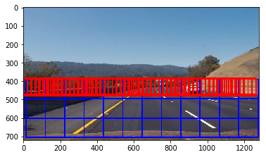


#### 2. Show some examples of test images to demonstrate how your pipeline is working. What did you do to optimize the performance of your classifier?

Below you can find some images with classified cars. As mentioned above, for classification I used HOG, spatial and color features. To improve car detection, I made sure that all regions of the image are covered by many sliding windows. In this way, it is much easier to remote outliers.


```python

```


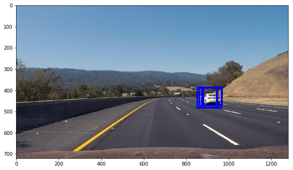


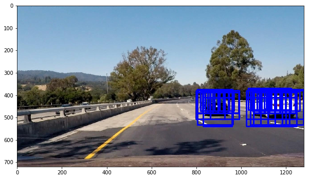


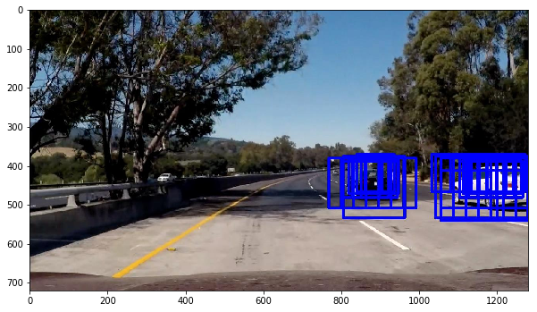


### Video Implementation

#### 1. Provide a link to your final video output. Your pipeline should perform reasonably well on the entire project video (somewhat wobbly or unstable bounding boxes are ok as long as you are identifying the vehicles most of the time with minimal false positives.) 

The output video is stored in the file: [output_video.mp4](https://github.com/nmitsou/CarND-Vehicle-Detection/blob/master/output_video.mp4)

#### 2. Describe how (and identify where in your code) you implemented some kind of filter for false positives and some method for combining overlapping bounding boxes.

I recorded the positions of positive detections in each frame of the video. From the positive detections I created a heatmap and then thresholded that map to identify vehicle positions. I then used scipy.ndimage.measurements.label() to identify individual blobs in the heatmap. Finally, I assumed that each blob corresponded to a vehicle and constructed bounding boxes to cover the area of each blob detected.

Here's an example result showing the heatmaps for the three images shown above:


```python

```


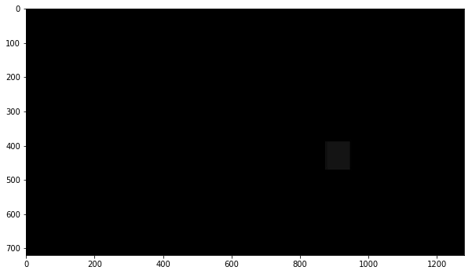


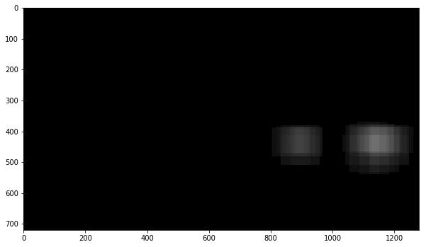


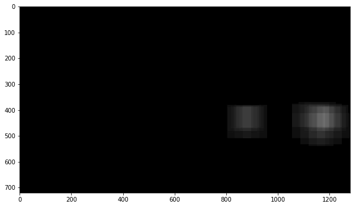


And here is the result of labels on the above heatmaps


```python

```


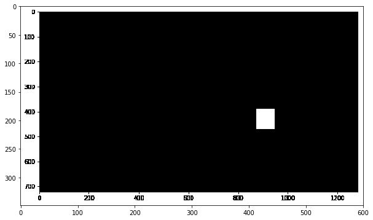


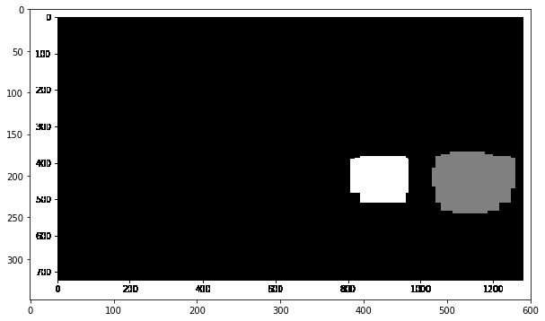


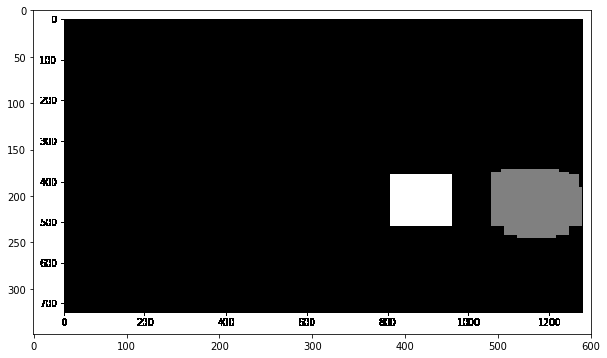


Finally, below you can find the above images with a bounding box around every car:


```python

```


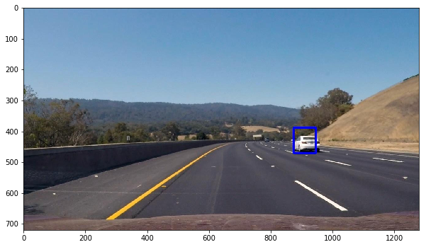


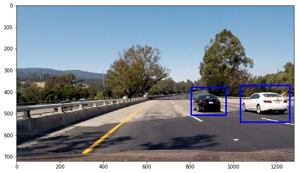


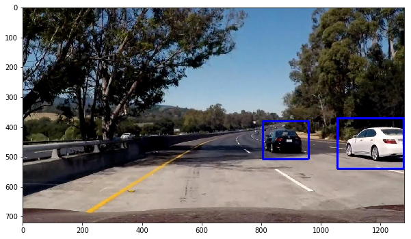

In order to get more stable bounding boxes, I implemented a multi-frame accumulated filter: I stored the heatmaps of the last 5 frames and used the accumulated heatmap 
for labeling.

### Discussion

#### 1. Briefly discuss any problems / issues you faced in your implementation of this project. Where will your pipeline likely fail? What could you do to make it more robust?

One issue I faced in this project was the existence of false possitives in classification either on the left and center side of the street or on the areas that are covered by trees.
My initial attempt to filter the heatmap based on the heat was not successfull since I was also filtering out true positives. 
Thus, I decided to increase the number of sliding windows patterns which eventually removed most of the false positives.
In order to improve further, I added an accumulated heatmap that considers the last 5 frames to detect the car positions. In this way, the last false positives were eliminated and the bounding boxes around the cars became much more stable (in size).

What I would like to add in the current pipeline is a kalman filter on the positions (and maybe speed) of the cars. In this way, when we observe overlapping bounding boxes, they will not be merged as one car but rather stay independed.


```python

```


```python

```
